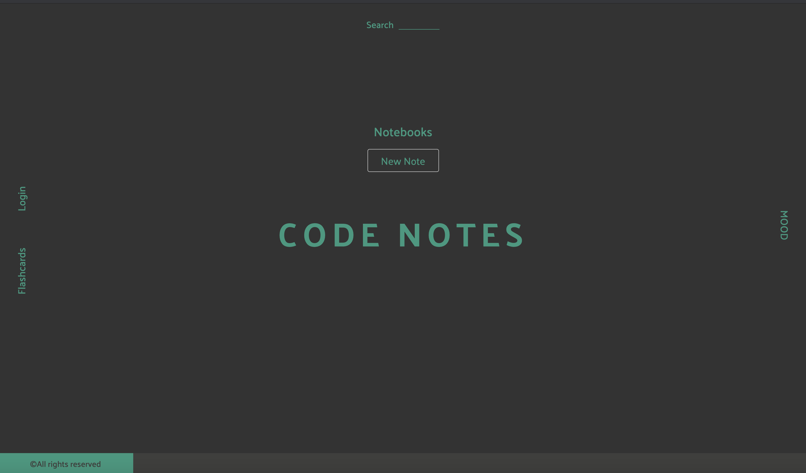

# class-notes
A web application for students who want to organize there Zoom recordings, class notes, and assignments in one place with their class/cohort-mates
# Technologies Used
* React.js
* Node.js
* Express
* PostgreSQL
* Webpack 4
* HTML 5
* CSS 3
* Bootstrap 4
* AWS EC2
# Live Demo
Link: https://code-notes.masonkeiser.com/
# Development
## System Requirements
* Node.js 10 or higher
* NPM 6 or higher
* PostgreSQL 10 or higher
# Getting Started
1. Clone this repository:
```
git clone https://github.com/mason-keiser/class-notes
```
2. Locate cloned repository: 
```
cd class-notes
```
3. Install all dependencies with NPM:
```
npm install
```
4. Start postgreSQL server in terminal:
```
sudo service posgresql start
``` 
5. Create database that you will be using for the site:
```
createdb class-notes
```
6. Import database to PostgreSQL:
```
npm run db:import
```
7. Open a second terminal; navigate to project directory, start pgweb:
```
pgweb --db=class-notes
```
8. Start the project (in another terminal). You can view the application by opening http://localhost:3000 in your browser:
```
npm run dev
```
# Preview

